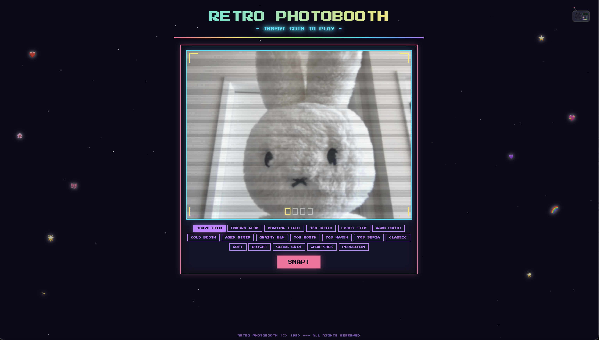
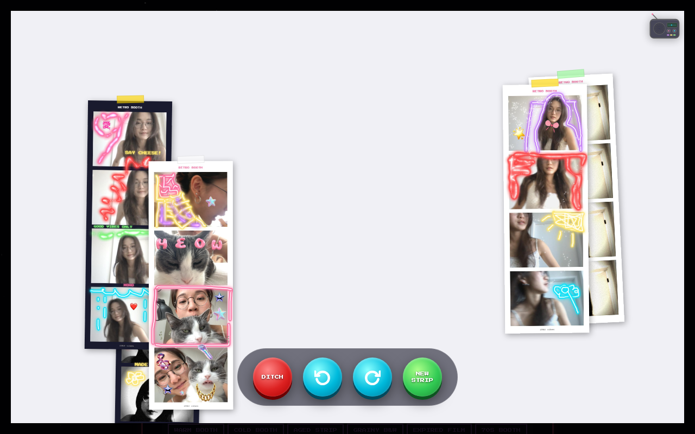

# 📸 Retro Photobooth

A retro-styled photobooth web app inspired by purikura and 80s arcade aesthetics. Take 4 photos, decorate your strip, and pin it to a shared board with friends — all in the browser.

## Screenshots

### Camera & Filters


### Shared Board


## Features

- **18+ film filters** — Pure White, Tokyo Film, 90s Booth, Grainy B&W, 70s Harsh, and more
- **Strip editor** — add stickers, stamps, freehand drawing (marker, neon, airbrush, glitter)
- **Sticker categories** — acc, alphabet, bear, heart, others, shape, star
- **Shared board** — strips are uploaded to Firebase and pinned on a live corkboard others can see
- **Mobile friendly** — responsive layout optimised for phones
- **30-minute timer** — auto-saves your strip when time is up

## Stack

- React 19 + Vite
- Firebase Firestore
- Canvas API for filters and export
- Playwright for screenshots

## Local Dev

```bash
nvm use 20
npm install
npm run dev
```

Requires a `.env.local` with Firebase credentials (see `.env.example`).
